# SQL notes

SQL, or Structured Query Language, is a language designed to allow both technical and non-technical users query, manipulate, and transform data from a relational database. And due to its simplicity, SQL databases provide safe and scalable storage for millions of websites and mobile applications.

A relational database management system (RDBMS) is a program that allows you to create, update, and administer a relational database. Most relational database management systems use the SQL language to access the database.

Many RDBMSs use SQL (and variations of SQL) to access the data in tables. For example, SQLite is a relational database management system. SQLite contains a minimal set of SQL commands (which are the same across all RDBMSs). Other RDBMSs may use other variants.

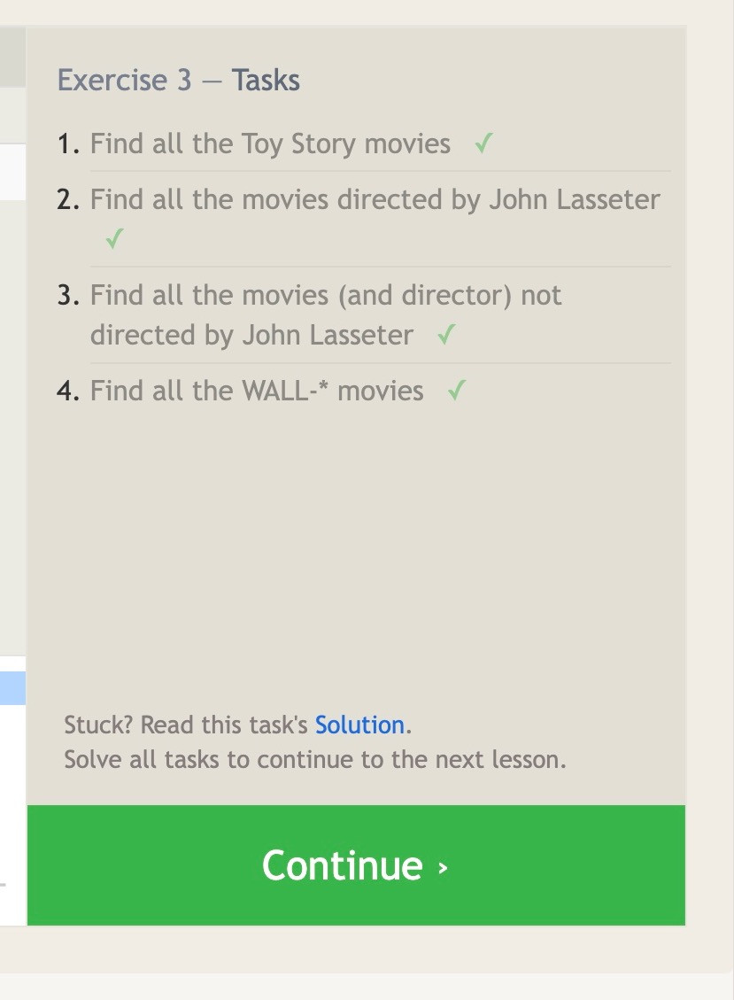
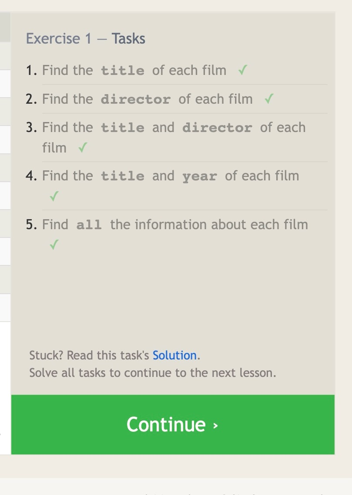
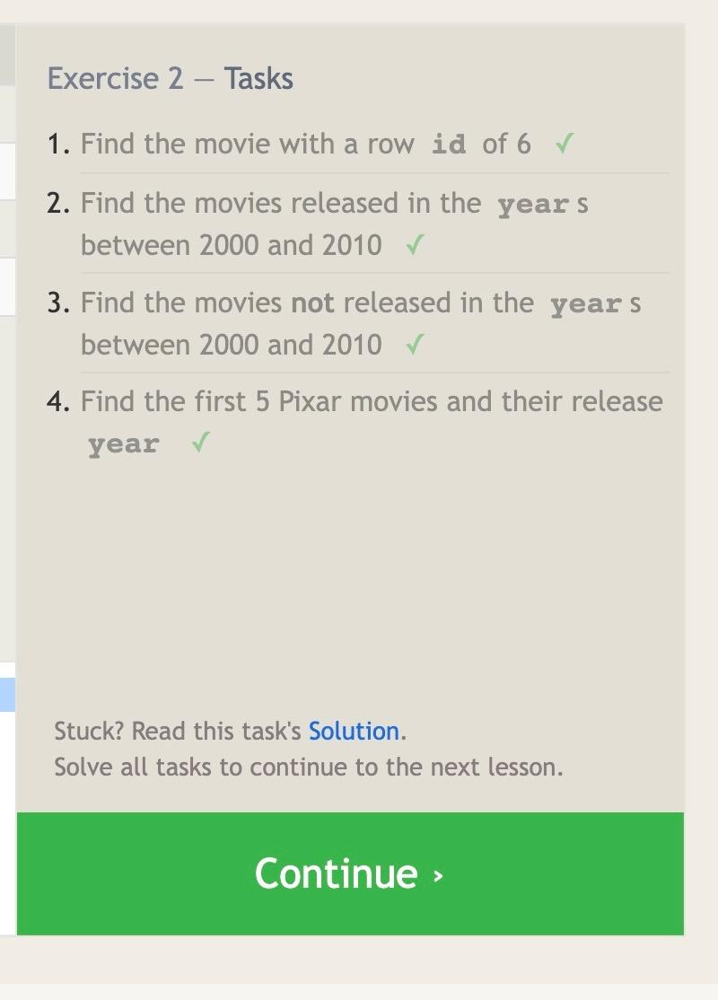
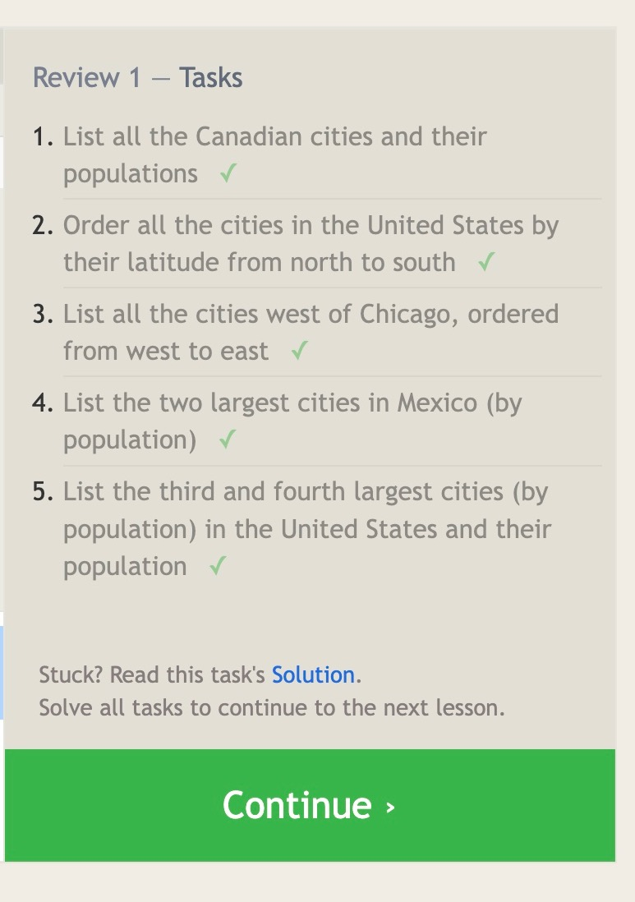
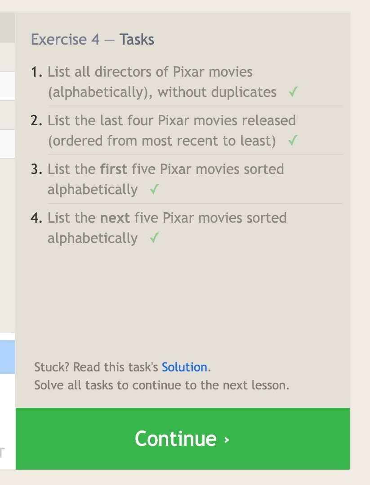
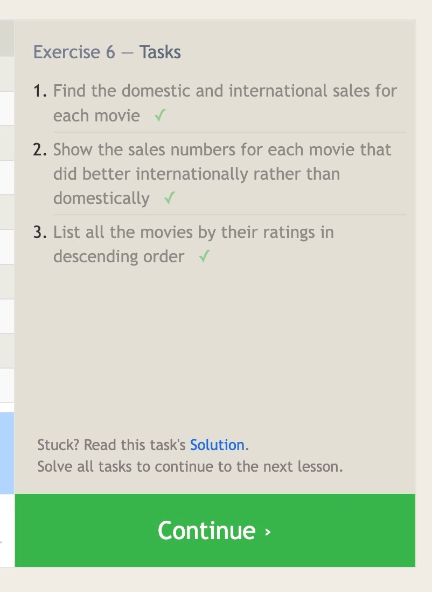
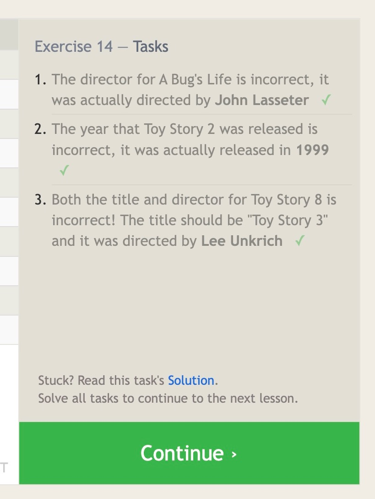
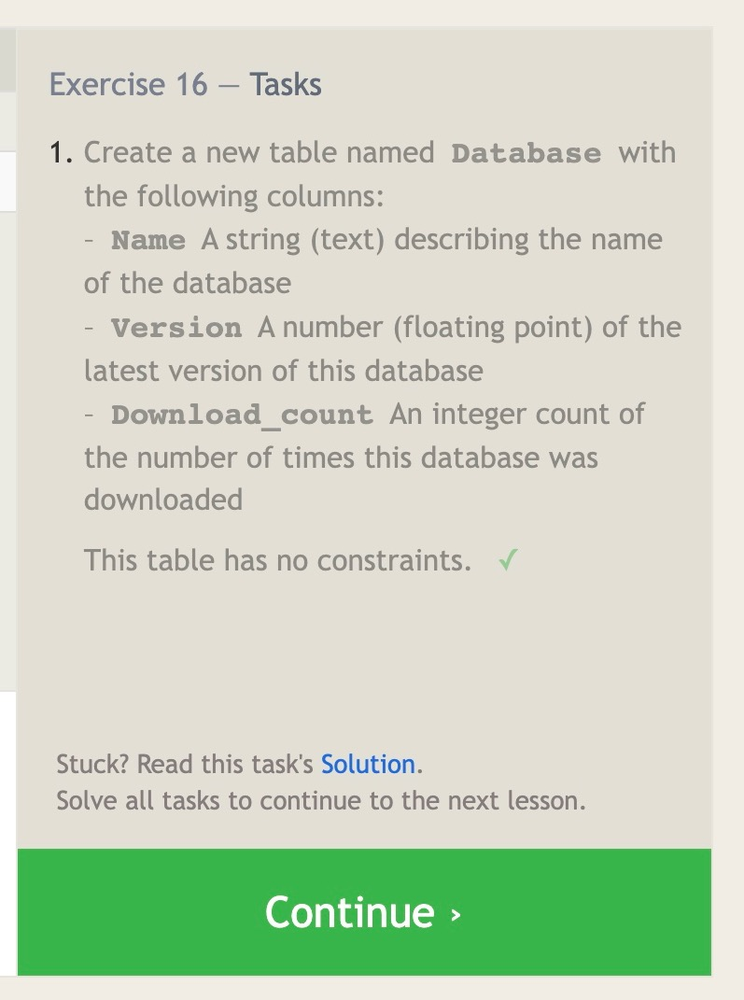
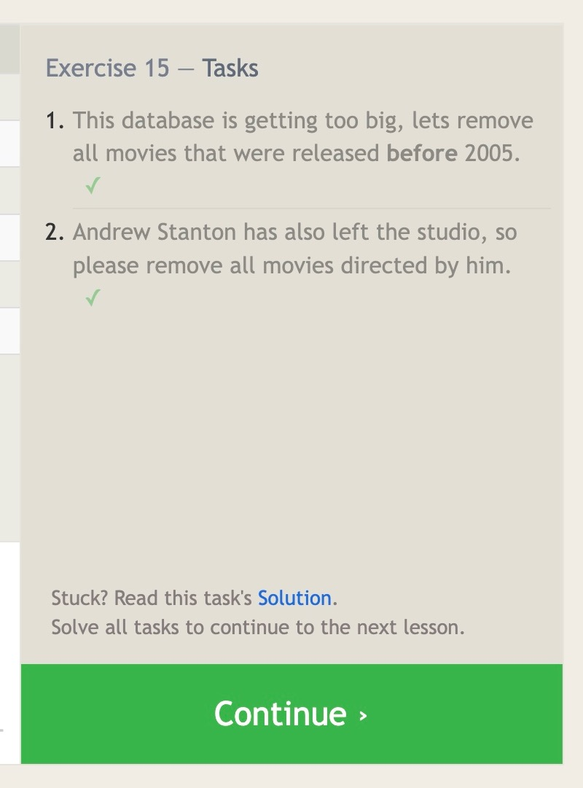
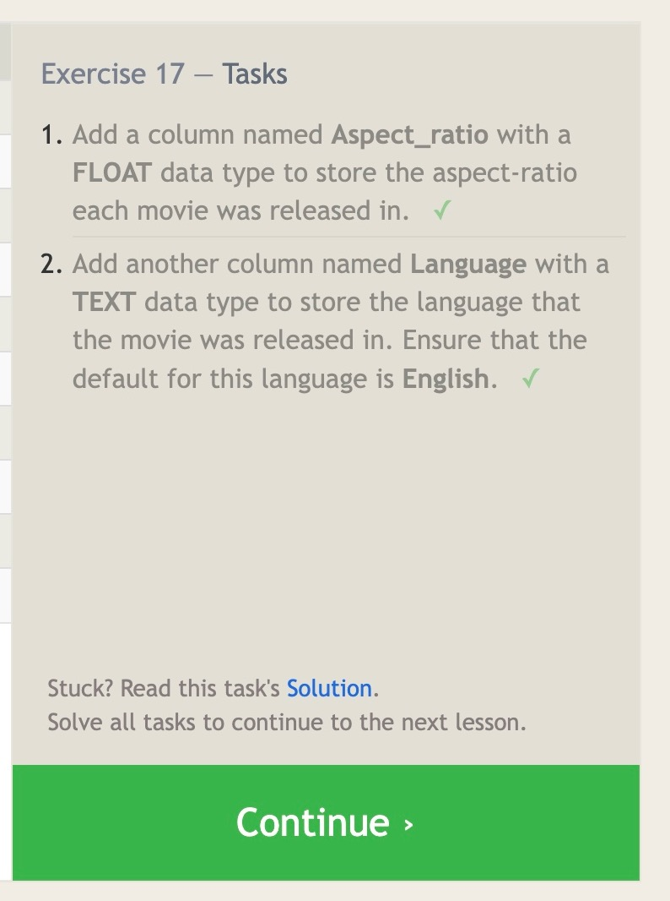
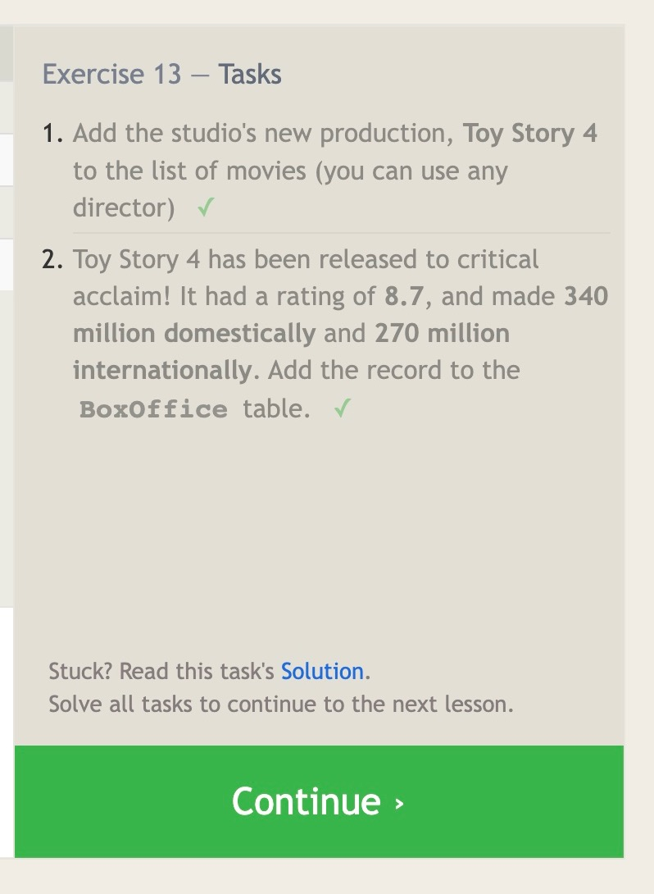

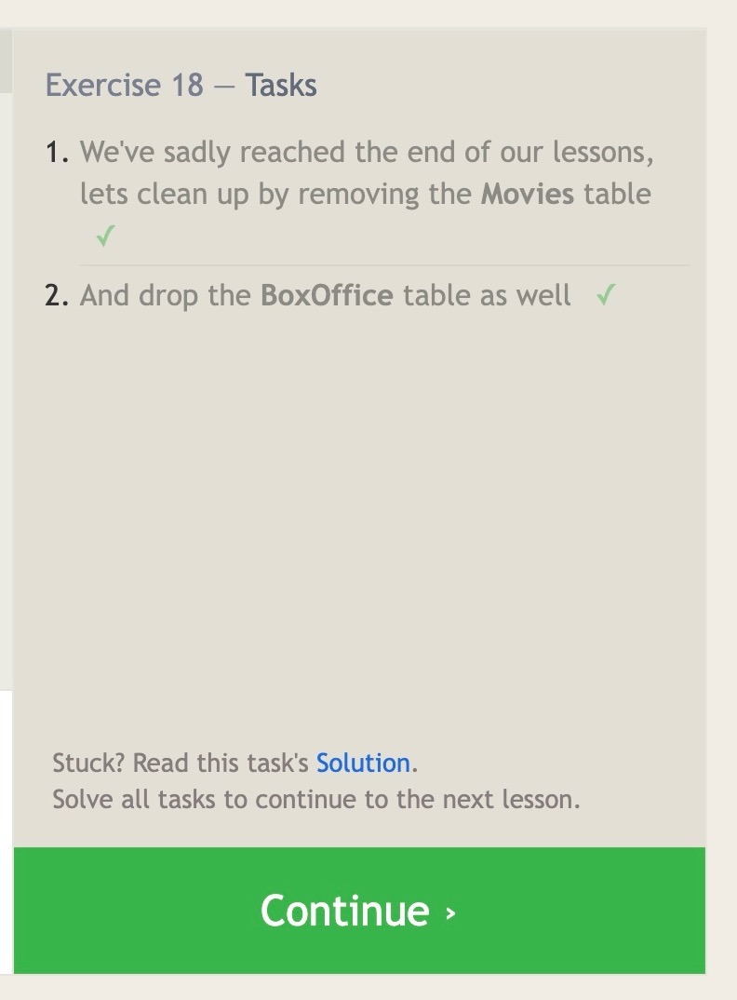
